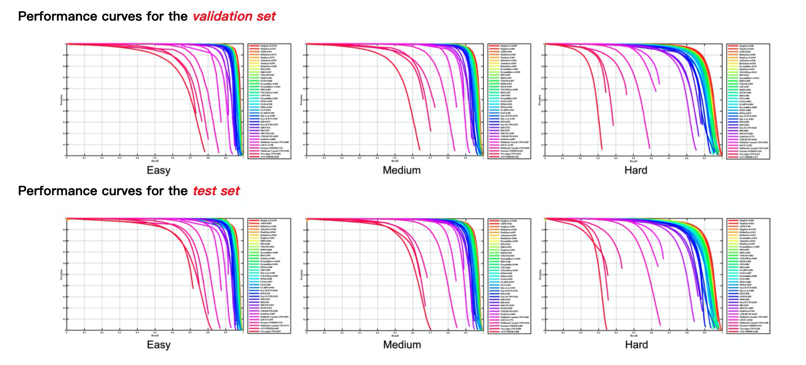

# MogFace: Towards a Deeper Appreciation on Face Detection

## Top News

**`2021.11`** We released a pytorch-vesion MogFace training and inference code.

**`2021.03`** We achieved **Rand-1st** across all testing scenarios  on [WIDER FACE](http://shuoyang1213.me/WIDERFACE/WiderFace_Results.html).

## Introduction
- In this repo, we propose a promising face detector, termed as MogFace. 

- Our MogFace consists of 3 novel modules, including Ali-AMS, SSE and HCAM.

- Our MogFace achieves six champions on [WIDER FACE](http://shuoyang1213.me/WIDERFACE/WiderFace_Results.html).

<center class="half"></center>

## Prepare Environment
```
conda create -n MogFace python=3.6
conda activate MogFace
pip install -r requirements.txt
cd utils/nms && python setup.py build_ext --inplace && cd ../..
cd utils/bbox && python setup.py build_ext --inplace && cd ../..
```
## Data Preparation
1. Download [preatrain_weights](https://drive.google.com/drive/folders/123ax1VSnza-G-MA8eB8W85O8FftsdMLI?usp=sharing) into pretrain_weights
2. Download the [WIDERFACE](http://shuoyang1213.me/WIDERFACE/WiderFace_Results.html) dataset.
3. Organize the dataset directory under Mogface/ as follows; We also provide the [organized dataset](https://drive.google.com/file/d/1seYeS6QElkeQG-rH0mfBXBx48jsaioow/view?usp=sharing).

```Shell
  dataset/WIDERFACE/
    WIDER_train/
      images/
    WIDER_val/
      images/
    WIDER_test/
      images/
    wider_face_split/
      wider_face_train_bbx_gt.txt
      wider_face_val.mat
      wider_face_test.mat
    ground_truth/
```

## Training

1. Train Ali-AMS
```
  CUDA_VISIBLE_DEVICES=0,1,2,3 python train.py -c configs/mogface/MogFace_Ali-AMS.yml
```

2. Train SSE
```
  CUDA_VISIBLE_DEVICES=0,1,2,3 python train.py -c configs/mogface/MogFace_SSE.yml
```

3. Train HCAM
```
  CUDA_VISIBLE_DEVICES=0,1,2,3 python train.py -c configs/mogface/MogFace_HCAM.yml
```

## Testing

1. Single scale test on $CONFIG_FILE$
```
  CUDA_VISIBLE_DEVICES=0 python test_single.py -c $CONFIG_FILE$
  CUDA_VISIBLE_DEVICES=0 python test_single.py -c configs/mogface/MogFace_Ali-AMS.yml
```

2. Multi scale test on $CONFIG_FILE$
```
  CUDA_VISIBLE_DEVICES=0 python test_multi.py -c $CONFIG_FILE$
```

## MogFace Pretrained Models

|      Name      | Easy  | Medium | Hard   | Link                                                         |
| :------------: | ----- | ------ | -----  | ------------------------------------------------------------ |
|   MogFace_Ali-AMS (SS_test) | 94.6 | 93.6  | 87.3  | [download](https://drive.google.com/drive/folders/1wMrfwrYSirGnLcMUC_KCCCr0Xd12uVzk?usp=sharing) |
|   MogFace_SSE (SS_test) | 95.6 | 94.1  | - | [download](https://drive.google.com/drive/folders/1vxVXeZcEF8Pu6wjN2yJ8iRgbKBA07qrb?usp=sharing) |
|   MogFace_HCAM (SS_test) | 95.1 | 94.2  | 87.4 | [download](https://drive.google.com/drive/folders/1LCizKuX-3yJhDkzBaLJ-6palKBoViqax?usp=sharing) |
|   MogFace-E (MS_test) | 97.7 | 96.9  | 92.0 | [download](https://drive.google.com/drive/folders/1X98-WesEQiQsf6xsy1jOXSHvxyEe3rl-?usp=sharing) |
|   MogFace (MS_test) | 97.0  | 96.3  | 93.0 | [download](https://drive.google.com/drive/folders/1OFcb0tDaIKv-qSvxXpEBpoc0dNxJzwyU?usp=sharing) |

* MS_Test: multi-scale testing
* SS_Test: single-scale testing
```
  CUDA_VISIBLE_DEVICES=0 python test_multi.py -c configs/mogface/MogFace.yml -n 140 --test_hard 1
  CUDA_VISIBLE_DEVICES=1 python test_multi.py -c configs/mogface/MogFace_E.yml -n 140
```
The best MogFace model and some tricks will be released soon.

### USAGE

  1. Download MogFace-E Pretrained Model from [link](https://drive.google.com/drive/folders/1X98-WesEQiQsf6xsy1jOXSHvxyEe3rl-?usp=sharing)
  2. mkdir -p snapshots/MogFace-E && mv model_140000.pth snapshots/MogFace-E/
  3. CUDA_VISIBLE_DEVICES=0 python test_multi.py -c configs/mogface/MogFace-E.yml -n 140

## References

```
@article{liu2021mogface,
      title={MogFace: Rethinking Scale Augmentation on the Face Detector},
        author={Liu, Yang and Wang, Fei and Sun, Baigui and Li, Hao},
          journal={arXiv preprint arXiv:2103.11139},
            year={2021}
            }
```
